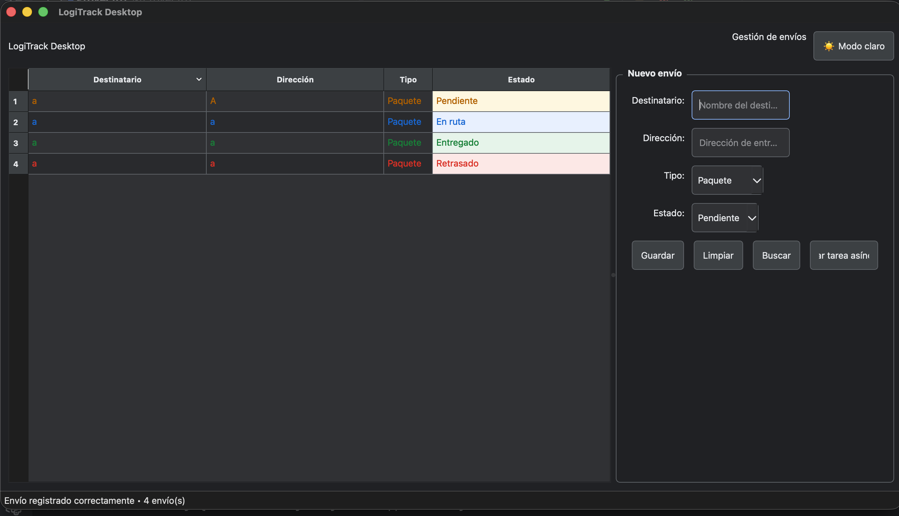

# Fase 5 — Componentes avanzados y estilos

## Objetivo

Mejorar la interfaz de LogiTrack Desktop mediante componentes avanzados de PyQt6, presentación visual de estados y un sistema centralizado de temas.

## QTableView

La tabla principal utiliza `QTableView` junto con un modelo personalizado basado en `QAbstractTableModel`.

Esto permite separar los datos de su representación visual y proporciona funcionalidades más avanzadas que `QTableWidget`.

Características implementadas:

- Selección por filas.
- Columnas redimensionables.
- Ordenamiento mediante encabezados.
- Filas alternadas.
- Modelo de datos independiente.
- Presentación visual de los estados.

## Modelo de tabla

El archivo:

`logitrack/models/shipment_table_model.py`

implementa `ShipmentTableModel`.

El modelo utiliza diferentes roles de Qt:

- `DisplayRole`: muestra el contenido.
- `ForegroundRole`: determina el color del texto.
- `BackgroundRole`: determina el color de fondo.

Esto permite representar visualmente los diferentes estados de los envíos.

## Estados

Los estados disponibles son:

| Estado | Representación |
|---|---|
| Pendiente | Naranja |
| En ruta | Azul |
| Entregado | Verde |
| Retrasado | Rojo |

Además del color del texto, la celda de estado utiliza un fondo de tonalidad suave.

## Sistema de temas

Los estilos visuales se centralizan en:

`logitrack/ui/theme.py`

Se implementaron dos temas:

- Tema claro.
- Tema oscuro.

La función:

`get_theme(dark=False)`

permite seleccionar el estilo correspondiente.

De esta manera se evita distribuir valores de estilo directamente dentro de las ventanas y widgets.

## Cambio de tema

La ventana principal incorpora un botón para alternar entre:

- 🌙 Modo oscuro
- ☀️ Modo claro

El cambio se realiza dinámicamente mediante `QApplication.setStyleSheet()`.

## Diseño responsive

La interfaz mantiene el uso de administradores de geometría y `QSplitter`, evitando posiciones absolutas.

Esto permite adaptar la distribución de la ventana cuando el usuario modifica su tamaño.

## Evidencia

Agregar aquí capturas de pantalla de:

1. Tema claro.
2. Tema oscuro.
3. Tabla con diferentes estados.
4. Ordenamiento de la tabla.

## Resultado

La Fase 5 incorpora componentes avanzados de PyQt6 y una presentación visual más cercana a una aplicación de escritorio profesional.

La interfaz cuenta ahora con una tabla basada en modelo, estados visuales y soporte para temas claro y oscuro.

El usuario puede cambiar dinámicamente al tema oscuro mediante el botón de cambio de tema.
